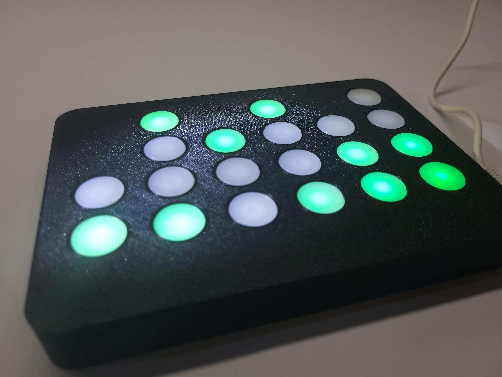

# Tindie Page [Here](https://www.tindie.com/products/boredbuilder/binary-clock-v2)

# What makes it so special?
The clock was designed and fabricated because I was inspired and curious the first time I saw one. I wanted to share this excitement with others, and after a year of development, I finally decided to release it.

# Description
The binary-coded decimal display houses 20 LEDs to show 6-digit military time to anyone who knows how to read it. The clock is easy to set up thanks to its onboard wireless esp32s3 chip by Expressif that also gathers time data to display on the LEDs.

# Features
- Wifi Connected
- Auto Dimming 
- Auto Daylight Savings Time
- USB Type C and 12v Barrel Jack

# Includes
- 12 volt power adapter 
- Two Prop stands 
- V2 Clock

# How do you set it up? *Check Video
Connect power on the right side of the clock with the included 12 volt power supply or a simple USB C cable. Once powered, get a phone or computer, go to wifi settings, and connect to the clock’s wifi. Once connected to the clock, it should redirect you to the clock’s web page where you can enter the wifi credentials of the home or work network you want to use. 
If it doesn't redirect you, scan this QR code. 

After that select your respective US time zone and save. After a few seconds, the clock will turn green and display time.